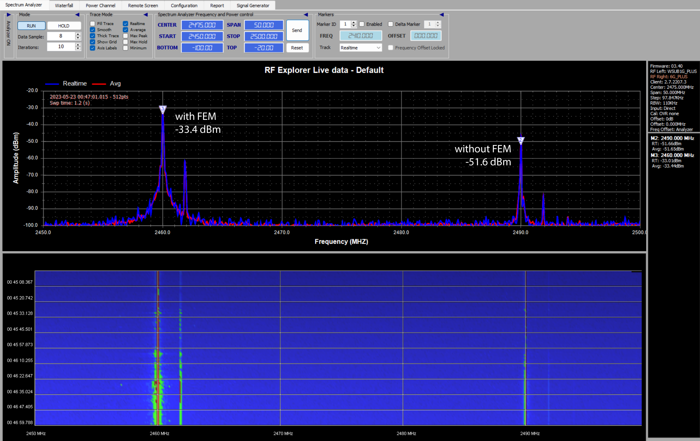
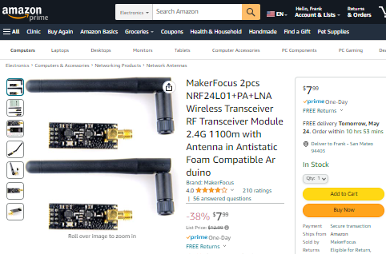

Using the nRF52840's Radio
==========================

The Roach ecosystem uses [Nordic Semiconductor nRF52840](https://www.nordicsemi.com/products/nrf52840) on both the remote controller and the robot. Specifically, I am using Adafruit's nRF52840 [Feather Express](https://www.adafruit.com/product/4062) and [ItsyBitsy](https://www.adafruit.com/product/4481). I came up with a custom RF communication protocol for the two nRF52840 to communicate with. (why? you ask? [link: project readme](readme.md))

Goals:

 * low latency, high refresh rate unidiretional control
 * must be somewhat immune to interference and to security attacks
 * must be stateless, recover quickly from disconnections, no requirement for being bidirectional
 * optional: bidirectional communication for telemetry and diagnostics
 * optional: execute auxiliary commands remotely

The nRF24L01 is the backbone of many popular hobby remote controls. So are the CYRF6936 from Cypress and CC2500 from Texas Instruments. The commercially available RC remote controls that use these chips all feature [FHSS, frequency hopping spread spectrum](https://en.wikipedia.org/wiki/Frequency-hopping_spread_spectrum). This is key to avoid interference, allowing for any model airplanes to fly together without problems. ([link to a project that uses all of these modules together](https://github.com/pascallanger/DIY-Multiprotocol-TX-Module/))

My communication protocol involves the nRF52840's radio being used in the same proprietary mode that can talk with a nRF24L01. The radio also supports 802.15.4 modes (think of Zigbee and Thread and such protocols) and BLE, but the Nordic proprietary protocol offers faster transmissions than the 802.15.4 mode, and is stateless, unlike BLE.

The latency is as low as physically possible since the radio is internal to the microcontroller, there's no latency from using a SPI bus (such as with an actual nRF24L01).

Operation
---------

From the remote-controller's point of view, packets are sent every 10 ms. Right after transmission, it goes into a listening mode for the optional telemetry from the robot. Right before the 10 ms mark, it changes the carrier frequency. (the commercially available remote controller use 20 ms intervals)

From the robot's point of view, it receives a packet, then immediately sends off the telemetry packet, and then hop the carrier frequency. If a packet is missed, it continues to keep to the 10 ms frequency hopping schedule in order to catch the next packet, but with the time window shifted just slightly earlier to make sure it can catch the next packet.

If the receiver fails to receive for too long (several seconds), it slows down the frequency hopping significantly, because there's a chance that both the transmitter and receiver are hopping at the same time, in the same sequence, but offset within the sequence. This can happen if either the transmitter or receiver unexpectedly reboots. The hop schedule is slowed down in order for the transmitter to catch up, so to speak. The hop schedule is never fully stopped to avoid being on a completely jammed frequency forever.

All of this is done by implementing a state machine. By experimentation I have determined that the timing does not require interrupts to be used. As long as the main thread executes the state machine function frequently enough, the 10 ms timing requirement can be easily met, and it can actually survive a few milliseconds of jitter.

The sequence of the frequency hopping is not sequencial, it is determined **finger-quote** cryptographically **/finger-quote**. This is discussed in the section where I talk about security.

The majority of the packets will be of the type that sends control data, such as throttle, steering, heading, weapon speed, etc, instructions for the robot to follow. The reply telemetry packet contains data such as the signal strength, battery status and such from the robot. There is also a text packet that can be sent by either side, the text packets are actually sent multiple times to make them extra reliable (duplicates are prevented via checking sequence numbers). Text is used for commands like "calibrate gyroscope", it is also used to transmit configurations between the remote controller and the robot, so the GUI on the remote controller can edit parameters on the robot.

It actually gets even cooler than that, I actually use the text message capability to slowly transfer files between the remote controller and the robot. The robot actually has a "descriptor" for itself, so one robot can have two wheels and two weapons, and the remote controller will display the settings for 2 wheels and 2 weapons, but another robot might have 3 wheels. The remote controller can download the descriptor file from the robot and know that it needs to show settings for 3 wheels instead of 2 when the user is looking at the GUI. This way, I do not need to do any firmware updates to the remote controller if I ever design a new robot, and I can bring two entirely different robots to a competition and use just one remote controller.

Extended Frequency Range
------------------------

There's a huge advantage of the nRF52840 chip: it can actually use frequencies below 2.4 GHz, the radio allows for an **extended frequency range down all the way to 2.36 GHz**.

I was informed by Nordic Semiconductor's engineers:

> I believe these frequencies are reserved for aeronautical mobile telemetry (AMT) systems used to support flight testing of aircraft, missiles, etc. I think there was some talk while back on using part of this band for medical (body sensor networks) as well.

My own research from FCC registrations show that LTE cellular devices also use this band but they are only for the Asian market.

The FEM RF Amplifier
--------------------

I also designed a FEM (front-end-module) using a [Skyworks RFX2401C chip](https://www.skyworksinc.com/Products/Front-end-Modules/RFX2401C). It's a RF power amplifier and LNA combo chip that's supposed to boost my transmission power by about +22 dBm. I designed a tiny PCB with this chip on it, with a u.FL connector to connect an external high-gain antenna.

The chip-antenna on the nRF52840 module is removed, and the small PCB is soldered on top of where the old chip-antenna used to be, copper shielding sheets are used to establish the ground to the module shielding. The copper is quite thick so the connection is mechanically strong. All traces are very short to minimize losses from insertion and from impedance mismatch.

The design for this PCB is found in my repo: https://github.com/frank26080115/robots/tree/main/Roach/libraries/nRF52RcRadio/elec-fem

The results looks good, showing a significant gain when testing with a continuous carrier wave, and RSSI is also improved.

However, since this is not an automatically switching FEM, I had to use GPIO pins to place the FEM in either transmit mode or receive mode, toggled with my state machine code. This means the FEM is not compatible with Bluetooth usage, as the Bluetooth stack Nordic Semiconductor provides is closed source. (Nordic sells their own compatible FEM, but it's more complex, uses 2 antennas and needs a SPI bus to control)

It is very common to find nRF24L01 being sold with a similar FEM already attached, which is one of the inspirations for me adding a FEM.

These combos are typically advertising a transmission range over 1 kilometer. I don't need that much range for my robotics competitions, but I know that the common commercially available hobby remote controllers do actually implement some sort of amplifier internally, as model aircrafts do need long ranges.

Testing and Diagnosis
---------------------

I purchased a portable spectrum analyzer, the [RF Explorer](https://j3.rf-explorer.com/), to verify the correct operation of my frequency hopping and the amplifier.

It works great and is a neat toy to own, but it does have trouble actually catching each packet sent by the nRF52840. My payload length is usually 64 bytes, which means the transmission is very short and the spectrum analyzer is likely to miss the packets during the scans. So while testing, I maximize the packet length (it's about 256 bytes). Then they start showing up on the waterfall graph.

The above screenshot shows my frequency hopping algorithm on 6 frequencies. There is another device at 2450 MHz, I don't know what it actually is.

Problem Involving SoftDevice
----------------------------

I ran into some problems during this project's development. First, my FEM didn't seem to actually work, the constant-carrier test did show a massive boost in transmit power but when I do a comparison between using my FEM and without, the FEM caused massive amounts of bit-errors. I thought it was because of a design error, and I was about to scrap the FEM completely. But then, I discovered something else while integrating the true-random number generator of the nRF52840, it seemed like initializing the RNG caused the radio to stop working, my transmitter was reporting that it's successfully sending, but the receiver never gets any packets, not even corrupted ones. By experimentation, I found that it wasn't the RNG's fault, but it seemed like, if I initilize the radio even a microsecond later, it wouldn't work.

I love Nordic Semiconductor. They make the nRF24L01 that was very popular and affordable many years ago. They were amongst the first to make BLE easily accessible to the DIY hobby community, which actually meant them being the first to enable DIY projects that involved iPhones and iPads (because iOS had no security restrictions on BLE devices, but heavy restrictions on BT Classic). I was actually able to do independant contractor work making wearable devices while I was still in college because the nRF51 family of chips.

Nordic Semiconductor is able to provide BLE functionality through what they market as SoftDevice, which is a binary blob Bluetooth stack. From my experience building wearable devices, I became familiar with it. It is closed source but distributed for free and it is actually delivered with the Adafruit Feather nRF52840 Express.

I originally ignored this. I thought that if I never call any BLE related APIs, the SoftDevice wouldn't do anything. I was wrong to assume this.

All of these problems, including the FEM not performing well, went away as soon as I added a simple call to`sd_softdevice_disable()` in my code. I think (but cannot confirm) the SoftDevice runs on a background timer and changed the settings of the radio. Poor reception could mean the radio's power level was changed, and no reception could mean the modulation setting was changed.

Sorry for the rant, but I do hope this helps somebody. I am sooooo lucky that I had enough experience to even know what SoftDevice is.

Security
--------

I fully support the "never roll your own security" mindset. This whole project is for fun.

Both the remote controller and the robot have a secret 32-bit salt value. This salt is used to initialize the CRC verification of the packet. Without knowing the salt, it is practically impossible to impersonate the remote controller in order to hijack the robot, as an adversary is unable to construct any packets that would be considered valid. This salt is never transmitted wirelessly, it is never shown on the GUI screen.

Each packet transmitted contains a sequence number. The robot will ignore any packets that doesn't have a sequence number higher than the one received previously. However, if the remote controller is rebooted for some reason, the sequence number will go back to zero. Each time the remote controller boots up, it generates a truely random session ID. The robot will see the new session ID and reset its internal track of the sequence numbers so that the communication is uninterrupted even if the remote controller needed to reboot. Old session IDs are placed in a database so that they cannot be reused to hijack the robot (by means of replay attack). However, the database does have a size limit.

Another layer of security is another 32-bit integer shared between the remote controller and the robot, this number is changed at the beginning of every match. This further prevents replay attacks. This number is different from the salt, and it is always transmitted with every packet, but it is also convenient for me to change before every competition match. Think of this number as the pairing ID number.

If my adversary attempts to record packets from a currently on going competition match, and then replay them, the robot will ignore the attack because of the sequence number. If any of the replayed packets have a session ID that already exists in the invalid-session database, then the packets are ignored. My adversary might record packets from so long ago that the database no longer contains that session ID, but then I would've changed the unique pairing ID by that time, maybe even changed the salt value, and thus the robot will ignore those packets.

On top of all this, the nRF52840 supports on-the-fly AES encryption and decryption, all done automatically and transparently. Encryption does not prevent replay attacks or denial-of-service attacks, but it does prevent attacks attempting to calculate the salt value.

The sequence of the frequency hopping is not sequencial. It appears random, but it is actually a product of the unique ID and the salt. Without knowing the salt value, it is practically not possible to predict the frequency hopping sequence.

I know how to implement an actual true random hop sequence, it involves constantly delivering a random schedule from the transmitter to the receiver, encryption can be used to keep the schedule a secret. I did not put this effort in.

The whole system is still vulnerable to jamming and denial-of-service attacks. **There's no way around this. Anybody with money can simply buy enough transmitters to jam all the frequencies all at once.** In theory, one competitor could make a jammer that jams all the frequencies but also coordinate the jammer to also allow for the competitor's own robot to function, nobody else's. It's possible... if somebody actually did this, they'd be blacklisted from ever competing again and also probably face some fines from the FCC.

If there's a need for wireless transmission of secret data, the nRF52840 does offer NFC capabilities, but it is not enabled by default when you purchase the Adafruit nRF52840 Express, requiring a J-Link tool to enable. I did experiment with setting the nRF52840's transmit power to the lowest setting (actually second lowest) of -30 dBm. The transmission distance was very short, about 3 feet.

Random Number Generator
-----------------------

The nRF52840 features a hardware RNG. They don't say much about it, they don't talk about how it works. Once it is enabled, every once in a while, a random 8 bit number is generated, and optionally, an ISR can fire upon this event. Annoyingly, the datasheet specifically says that the rate of generation is actually unpredictable, they don't even offer a range of timings.

Sooooo if anybody is wondering, **I managed to generate a bit over 6000 numbers in the span of one second**. The time interval between each number might vary. I am writing this down in hopes that somebody looking for this data will find it here.

The code I wrote places these numbers in a FIFO buffer as they are generated. I don't use enough for the FIFO to ever fully drain. Once the FIFO is full, the ISR is disabled to prevent unnecessary interruptions of other processes. The FIFO can then also be filled from the main thread without using the ISR, or it can also automatically re-enable the ISR below a certain threshold. All of these behaviours can be adjusted in my code.

Firmware code library I wrote for the nRF RNG: https://github.com/frank26080115/robots/tree/main/Roach/libraries/nRF5Rand

Other Notes
-----------

The latest official SDK for the nRF52840 is much further ahead than the one included with Arduino IDE. Sometimes this causes compatibility issues if you attempt to add SDK files into your project. Although most of the time I solved this by not using the SDK at all, as the low level registers of Nordic's products are very intuitive to use without using their SDK. They widely use the concept of events, tasks, and shortcuts. To perform a task like transmit the packet, just write 1 into the appropriate task register.

Previous Attempt with ESP32
---------------------------

Before I started using the nRF52840, I was actually working on this project using ESP32 instead. The ESP32 had the advantage of having Wi-Fi capabilities, allowing for features such as serving a web interface for parameter adjustments. To meet my goals, I did not use the Wi-Fi radio with actual Wi-Fi communication. What I did was use some low level calls to the ESP-IDF API, it sent raw packets using `esp_wifi_80211_tx()`, and on the receiver end, promiscuous mode was used on the receiver side to receive these packets, a callback function could be attached with `esp_wifi_set_promiscuous_rx_cb()` to run upon any 802.11 packet seen, and a set of IDs and checksums made sure it was a packet sent by the Roach transmitter. The `esp_wifi_set_channel()` function was used to perform the channel hopping.

This worked, but only sort of... Once I pushed the transmission rate high enough, 10 ms interval, the receiver started to report massive amounts of packet loss. Even at 20 ms, it wasn't as reliable as I wanted it to be. But I did need this to beat commercially available products.

Diagnosing this involved using a logic analyzer. GPIO pin toggles were performed on execution of the callback functions, the transmission, and channel hop. The logic analyzer showed the timings of these events. Two receivers were used during these tests, each one on a different channel, and without any channel overlap. If a receiver showed that it received two packets consecutively while the other receiver did not, then I know the channel hop never happened.

In an ideal everything-working situation, I expected to see neat square waves from the logic analyzer. What I actually saw was a giant mess.

The ESP32's internal code did not actually perform the channel hopping and the transmission at the time of the function call. The `esp_wifi_set_channel()` call was not effective immediately, which caused some huge problems. The packets being sent were also queued together and sent in bursts, the receiver would receive 5 packets all at once, instead of one every 10 millisecond.

I did use Espressif's support forum to ask for help, specifically to ask how I can check if the channel has finished changing, and how to check a packet has been actually sent. They actually deleted my forum topic, refusing to help, censoring the hint to other users that their products can be used this way. Technically this is an exploit, previously these APIs were used to [perform denial-of-service attacks by sending disassociation packets](https://github.com/justcallmekoko/ESP8266_Deauth_All). Today the API actually does have internal checks to make sure you don't send any packets that might be used for an attack, but I'm pretty sure you can still do it if you obtained an older version of ESP-IDF. (see projects like [this one](https://github.com/Jeija/esp32free80211) and also [this one](https://github.com/Jeija/esp32-80211-tx))

After realizing that this approach was never going to work on ESP32, I switched to using the nRF52840.
